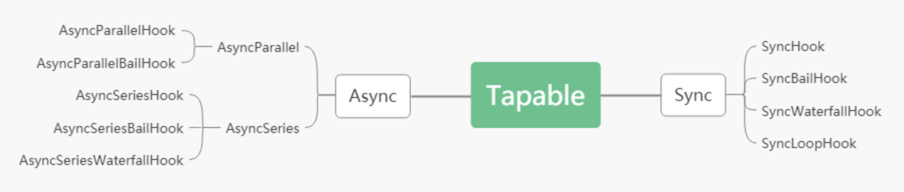
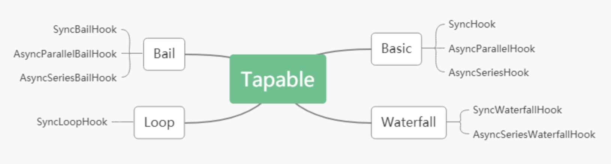

# webpack 核心 tapable

## 前言
- 我们都知道 webpack 这款模块化打包工具具备着很强大很完善的一种扩展能力, 它强大到可以实现我们在打包过程中遇到的各种各样的打包需求, 那么这种能力是从何而来的?
- 这个问题对于大家而言应该不难, webpack 这种夸张的扩展能力来自于他本身的插件机制 (plugin) ,webpack 拥有非常完备的插件库, 所以我们可以在 webpack 上挂载各种各样的插件来实现我们的打包需求, 但是大家有没有想过 webpack 是如何做到这一点的?

## webpack 的插件机制
- 如果有调试过 webpack 源码去了解 webpack 打包过程的同学应该都会有一种感觉, webpack 的打包过程的跳跃性很强, 代码的执行过程从一个事件跳转到另一个事件, 读起来非常的不顺畅, 这是因为 webpack 工作机制决定的
- webpack 本质上是一种事件流的工作机制, webpack 的打包过程就是将它的内置插件跟我们挂载的插件串联起来, 然后在不同的时间节点去执行不同的插件, 最终通过一个个的插件来完成我们的打包工作
- 而 tapable 就是帮助 webpack 实现这个插件机制的核心, webpack 基于 tapable 去进行插件的挂载, 并在合适的节点又通过 tapable 去执行对应的插件
- 只有真正的了解了 tapable, 我们才能更清晰的去分析 webpack 的打包过程

## tapable 是什么?
- 他是 webpack 中实现的一个模块, 有点类似于 events , 基本的功能都是注册事件, 然后在合适的节点触发事件
- 但是 events 就是一个单纯的发布订阅模块, 而 tapable 更像是一个基于发布订阅实现的一种流程管理工具

## tapable 中的 hooks
- 学习 tapable 就是学习它的各种各样的 hook
- 我们先大致看下 tapable 都有多少种 hook

### 按照同步异步分类
- hook 的类型可以分位 `同步Sync` 和 `异步Async`, 而异步又可以分为 `并行Parallel` 和 `串行Series`
  
### 按照 hook 的返回值分类
- hook 的类型可以分为 `Basic` `Bail` `Loop` `Waterfall` 四种
  
1. Basic 按照注册顺序 依次执行每一个事件函数 不关心函数的返回值
2. Bail 按照注册顺序 依次执行每一个事件函数 遇到函数返回值 !== undefined 时 终止执行
3. Waterfall 按照注册顺序 依次执行每一个事件函数 当函数的 result !== undefined 时, 该 result 会成为下一个事件函数的第一个参数
4. Loop 按照注册顺序 不断的执行每一个事件函数 直到所有函数的 result === undefined , 当某个函数 result !== undefined 时, 回到第一个函数 重新执行

### hook 的使用
- SyncHook 按照注册顺序 依次执行每一个事件函数 不关心函数的返回值
```js
const { SyncHook } = require('tapable');

// 所有的构造函数都接收一个可选参数，参数是一个参数名的字符串数组
// 参数的名字可以任意填写，但是参数数组的长数必须要根实际接受的参数个数一致
// 如果回调函数不接受参数，可以传入空数组
// 1. 通过 SyncHook 构造函数 创建一个钩子 hook
const hook = new SyncHook(['name', 'age']);

// 2. 通过 hook 的 tap 方法 注册一个事件函数
// 第一个参数 无实际意义 供开发者区分注册的每个事件函数
hook.tap('1', (name, age) => {
  console.log(1, name, age);
});
hook.tap('2', (name, age) => {
  console.log(2, name, age);
});
hook.tap('3', (name, age) => {
  console.log(3, name, age);
});

// 3. 通过 hook 的 call 方法 触发注册的事件函数
// 参数个数和实例化时的传入的数组长度有关
hook.call('baidu', 24);

// 事件函数的执行顺序 按照注册顺序执行 先入先出
// 执行结果
// 1 baidu 24
// 2 baidu 24
// 3 baidu 24
```
- SyncBailHook 按照注册顺序 依次执行每一个事件函数 遇到函数返回值 !== undefined 时 终止执行
```js
const { SyncBailHook } = require('tapable');

const hook = new SyncBailHook(['name', 'age']);

hook.tap('1', (name, age) => {
  console.log(1, name, age);
  return 1;
});
hook.tap('2', (name, age) => {
  console.log(2, name, age);
});
hook.tap('3', (name, age) => {
  console.log(3, name, age);
});

hook.call('baidu', 24);

// 事件函数的执行顺序 按照注册顺序执行 遇到函数返回值 !== undefined 时 终止执行
// 执行结果
// 1 baidu 24
```
- SyncWaterfallHook 按照注册顺序 依次执行每一个事件函数 当函数的 result !== undefined 时, 该 result 会成为下一个事件函数的第一个参数
```js
const { SyncWaterfallHook } = require('tapable');

const hook = new SyncWaterfallHook(['name']);

hook.tap('1', (name) => {
  console.log(1, name);
});
hook.tap('2', (name) => {
  console.log(2, name);
  return 2;
});
hook.tap('3', (name) => {
  console.log(3, name);
  return 3;
});

hook.call('baidu', 24);

// 事件函数的执行顺序 按照注册顺序执行
// 如果上一个回调函数的结果不为 undefined,则可以作为下一个回调函数的第一个参数
// 当回调函数返回 undefined 不会停止回调栈的调用，且下一个回调的参数还是当前函数接受的参数

// 执行结果
// 1 baidu
// 2 baidu
// 3 2
```
- SyncLoopHook 按照注册顺序 不断的执行每一个事件函数 直到所有函数的 result === undefined , 当某个函数 result !== undefined 时, 回到第一个函数 重新执行
```js
const { SyncLoopHook } = require('tapable');

const hook = new SyncLoopHook(['name']);

let counter1 = 0;
let counter2 = 0;
let counter3 = 0;

hook.tap('1', (name, age) => {
  console.log(1, 'counter1', counter1);
  if (++counter1 == 1) {
    counter1 = 0;
    return;
  }
  return true;
});
hook.tap('2', (name, age) => {
  console.log(2, 'counter2', counter2);
  if (++counter2 == 2) {
    counter2 = 0;
    return;
  }
  return true;
});
hook.tap('3', (name, age) => {
  console.log(3, 'counter3', counter3);
  if (++counter3 == 3) {
    counter3 = 0;
    return;
  }
  return true;
});

hook.call('baidu', 24);

// SyncLoopHook 的特点是不停的循环执行回调函数，直到所有函数的结果都等于 undefined
// 要注意的是每次循环都是从头开始循环的
// 执行结果 
// 一共15次
// 1 counter1 0
// 2 counter2 0

// 1 counter1 0
// 2 counter2 1
// 3 counter3 0

// 1 counter1 0
// 2 counter2 0

// 1 counter1 0
// 2 counter2 1
// 3 counter3 1

// 1 counter1 0
// 2 counter2 0

// 1 counter1 0
// 2 counter2 1
// 3 counter3 2
```
- AsyncParallelHook 异步并行执行钩子
  - tap 同步注册
```js
let { AsyncParallelHook } = require('tapable');
let queue = new AsyncParallelHook(['name']);

console.time('cost');

queue.tap('1', function (name) {
  console.log(1);
});
queue.tap('2', function (name) {
  console.log(2);
});
queue.tap('3', function (name) {
  console.log(3);
});

// 异步钩子 通过 callAsync 触发事件函数
queue.callAsync('baidu');

// 执行结果
// 同时输出 1 2 3
// 1
// 2
// 3
```
  - tapAsync 异步注册 回调函数形式
```js
let { AsyncParallelHook } = require('tapable');
let queue = new AsyncParallelHook(['name']);

console.time('cost');

queue.tapAsync('1', function (name, callback) {
  setTimeout(function () {
    console.log(1);
    callback(); // 调用 callback 代表当前事件函数执行完毕
  }, 1000);
});
queue.tapAsync('2', function (name, callback) {
  setTimeout(function () {
    console.log(2);
    callback();
  }, 2000);
});
queue.tapAsync('3', function (name, callback) {
  setTimeout(function () {
    console.log(3);
    callback();
  }, 3000);
});
// 异步注册是 callAsync 可以接收一个回调函数 当事件函数执行完毕时触发 
queue.callAsync('baidu', (err) => {
  console.log(err);
  console.timeEnd('cost');
});
// 执行结果
// 并行执行事件函数 每隔 1s 输出一次 最终耗时 3s 左右
// 1
// 2
// 3
// undefined
// cost: 3.002s
```
  - tapPromise 异步注册 promise形式
```js
let { AsyncParallelHook } = require('tapable');
let queue = new AsyncParallelHook(['name']);

console.time('cost');

// 通过 tapPromise 注册
// 事件函数需返回一个 promise 
queue.tapPromise('1', function (name) {
  return new Promise(function (resolve, reject) {
    setTimeout(function () {
      console.log(1);
      resolve();
    }, 1000);
  });
});
queue.tapPromise('2', function (name) {
  return new Promise(function (resolve, reject) {
    setTimeout(function () {
      console.log(2);
      resolve();
    }, 2000);
  });
});
queue.tapPromise('3', function (name) {
  return new Promise(function (resolve, reject) {
    setTimeout(function () {
      console.log(3);
      resolve();
    }, 3000);
  });
});

// 通过 callPromise 触发注册的 promise
queue.promise('baidu').then(() => {
  console.timeEnd('cost');
});

// 执行结果
// 并行执行事件函数 每隔 1s 输出一次 最终耗时 3s 左右
// 1
// 2
// 3
// cost: 3.002s
```
- AsyncParallelBailHook 异步并行 Bail 的钩子
- 当有一个任务返回值不为空时就直接结束
  - tapAsync
```js
let { AsyncParallelBailHook } = require('tapable');
let queue = new AsyncParallelBailHook(['name']);

console.time('cost');

queue.tapAsync('1', function (name, callback) {
  console.log(1);
  // 调用 callback 代表当前事件函数执行完毕
  // 调用 callback 传入的参数 表示当前事件函数的返回值
  callback('Wrong');
});
queue.tapAsync('2', function (name, callback) {
  console.log(2);
  callback();
});
queue.tapAsync('3', function (name, callback) {
  console.log(3);
  callback();
});

queue.callAsync('baidu', (err) => {
  console.log(err);
  console.timeEnd('cost');
});

// 执行结果
// 1
// Wrong
// cost: 5.541ms
```
  - tapPromise
```js
let { AsyncParallelBailHook } = require('tapable');
let queue = new AsyncParallelBailHook(['name']);

console.time('cost');

queue.tapPromise('1', function (name) {
  return new Promise(function (resolve, reject) {
    setTimeout(function () {
      console.log(1);
      // 调用 resolve / reject 代表当前事件 promise 执行完毕
      // 调用 resolve / reject 并传参时 代表当前事件的返回值
      resolve(1);
    }, 1000);
  });
});
queue.tapPromise('2', function (name) {
  return new Promise(function (resolve, reject) {
    setTimeout(function () {
      console.log(2);
      resolve();
    }, 2000);
  });
});

queue.tapPromise('3', function (name) {
  return new Promise(function (resolve, reject) {
    setTimeout(function () {
      console.log(3);
      resolve();
    }, 3000);
  });
});

queue.promise('baidu').then(
  (result) => {
    console.log('成功', result);
    console.timeEnd('cost');
  },
  (err) => {
    console.error('失败', err);
    console.timeEnd('cost');
  }

// 执行结果
// resolve 或者 reject 不传参时 等到全部执行完毕 结果为成功
// resolve 传参时 立刻执行完毕 结果为成功 
// reject 传参时 立刻执行完毕 结果为失败 
// 1
// 成功 1
// cost: 1.008s
// 2
// 3
```
- AsyncSeriesHook 异步串行钩子
  - tapAsync 任务一个一个执行 执行完上一个执行下一个
```js
let { AsyncSeriesHook } = require('tapable')
let queue = new AsyncSeriesHook(['name'])

console.time('cost')

queue.tapAsync('1', function (name, callback) {
  setTimeout(function () {
    console.log(1)
    callback()
  }, 1000)
})
queue.tapAsync('2', function (name, callback) {
  setTimeout(function () {
    console.log(2)
    callback()
  }, 2000)
})
queue.tapAsync('3', function (name, callback) {
  setTimeout(function () {
    console.log(3)
    callback()
  }, 3000)
})

queue.callAsync('baidu', (err) => {
  console.log(err)
  console.timeEnd('cost')
})

// 执行结果
// 1s 后输出 1 等 2s 后输出 2 等 3s 后输出 3 耗时 6s 左右
// 1
// 2
// 3
// undefined
// cost: 6.019s
```
  - tapPromise
```js
let { AsyncSeriesHook } = require('tapable')
let queue = new AsyncSeriesHook(['name'])

console.time('cost');

queue.tapPromise('1', function (name) {
  return new Promise(function (resolve) {
    setTimeout(function () {
      console.log(1);
      resolve();
    }, 1000);
  });
});
queue.tapPromise('2', function (name) {
  return new Promise(function (resolve) {
    setTimeout(function () {
      console.log(2);
      resolve();
    }, 2000);
  });
});
queue.tapPromise('3', function (name) {
  return new Promise(function (resolve) {
    setTimeout(function () {
      console.log(3);
      resolve();
    }, 3000);
  });
});

queue.promise('baidu').then((data) => {
  console.log(data);
  console.timeEnd('cost');
});

// 执行结果
// 1s 后输出 1 等 2s 后输出 2 等 3s 后输出 3 耗时 6s 左右
// 1
// 2
// 3
// undefined
// cost: 6.019s
```
- AsyncSeriesBailHook 异步串行 Baik 钩子
- 只要有一个返回了不为 undefined 的值就直接结束
  - tapAsync
```js
let { AsyncSeriesBailHook } = require('tapable');
let queue = new AsyncSeriesBailHook(['name']);

console.time('cost');

queue.tapAsync('1', function (name, callback) {
  setTimeout(function () {
    console.log(1);
    callback('wrong');
  }, 1000);
});
queue.tapAsync('2', function (name, callback) {
  setTimeout(function () {
    console.log(2);
    callback();
  }, 2000);
});
queue.tapAsync('3', function (name, callback) {
  setTimeout(function () {
    console.log(3);
    callback();
  }, 3000);
});

queue.callAsync('baidu', (err) => {
  console.log(err);
  console.timeEnd('cost');
});

// 执行结果
// 调用 callback 传入的参数 代表当前事件函数的返回值
// 只要有一个返回了不为 undefined 的值就直接结束
// 1
// wrong
// cost: 1.010s
```
  - tapPromise
```js
let { AsyncSeriesBailHook } = require('tapable');
let queue = new AsyncSeriesBailHook(['name']);

console.time('cost');

queue.tapPromise('1', function (name) {
  return new Promise(function (resolve) {
    setTimeout(function () {
      console.log(1);
      resolve();
    }, 1000);
  });
});
queue.tapPromise('2', function (name, callback) {
  return new Promise(function (resolve, reject) {
    setTimeout(function () {
      console.log(2);
      resolve('成功');
    }, 2000);
  });
});
queue.tapPromise('3', function (name, callback) {
  return new Promise(function (resolve) {
    setTimeout(function () {
      console.log(3);
      resolve();
    }, 3000);
  });
});

queue.promise('lee').then(
  (data) => {
    console.log('成功: ',data);
    console.timeEnd('cost');
  },
  (error) => {
    console.log'失败: ',(error);
    console.timeEnd('cost');
  }
);

// 执行结果
// resolve 不传参时 等到全部执行完毕 结果为成功
// reject 不传参时 立刻执行完毕 结果为失败
// resolve 传参时 立刻执行完毕 结果为成功 
// reject 传参时 立刻执行完毕 结果为失败 
// 1
// 2
// 成功:  成功
// cost: 3.010s
```
- AsyncSeriesWaterfallHook 异步串行 Waterfall 钩子
- 参数一层层向下传递
  - tapAsync
```js
let { AsyncSeriesWaterfallHook } = require('tapable');
let queue = new AsyncSeriesWaterfallHook(['name', 'age']);

console.time('cost');

queue.tapAsync('1', function (name, age, callback) {
  setTimeout(function () {
    console.log(1, name, age);
    callback(null, 1);
  }, 1000);
});
queue.tapAsync('2', function (data, age, callback) {
  setTimeout(function () {
    console.log(2, data, age);
    callback(null, 2);
  }, 2000);
});
queue.tapAsync('3', function (data, age, callback) {
  setTimeout(function () {
    console.log(3, data, age);
    callback(null, 3);
  }, 3000);
});

queue.callAsync('baidu', 10, (err, data) => {
  console.log(err, data);
  console.timeEnd('cost');
});

// 执行结果
// callback 第一个参数不为 null 时 立刻结束 输出错误
// callback 第二个参数有值时 作为下一个事件函数参数传入
// callback 第二个参数无值时 当前事件函数参数作为下一个事件函数参数传入

// 1 baidu 10
// 2 1 10
// 3 2 10
// null 3
// cost: 6.018s
```
  - tapPromise
```js
let { AsyncSeriesWaterfallHook } = require('tapable');
let queue = new AsyncSeriesWaterfallHook(['name', 'age']);

console.time('cost');

queue.tapPromise('1', function (name) {
  return new Promise(function (resolve) {
    setTimeout(function () {
      console.log(name, 1);
      resolve(1);
    }, 1000);
  });
});
queue.tapPromise('2', function (data) {
  return new Promise(function (resolve) {
    setTimeout(function () {
      console.log(data, 2);
      resolve(2);
    }, 2000);
  });
});
queue.tapPromise('3', function (data) {
  return new Promise(function (resolve) {
    setTimeout(function () {
      console.log(data, 3);
      resolve(3);
    }, 3000);
  });
});

queue.promise('baidu').then((data) => {
  console.log('成功: ',data);
  console.timeEnd('cost');
}).catch((err) => {
  console.log('失败: ',err);
  console.timeEnd('cost');
})

// 执行结果
// 调用 resolve 无参时 当前事件函数参数作为下一个事件函数参数传入
// 调用 resolve 有参时 改参数作为下一个事件函数参数传入
// 调用 reject 无参时 立刻结束 失败
// 调用 reject 有参时 立刻结束 失败

// baidu 1
// 1 2
// 2 3
// 成功:  3
// cost: 6.012s
```

### hook 的拦截器 interceptor 
- tapable 提供的所有 hook 都支持 interceptor , 此拦截器与 axios 中的拦截器非常相似
- 通过 hook 的拦截器 可以对该 hook 的整个流程进行监听, 并触发对应的逻辑
- intercept() hook 的拦截器 API
  - register: 当 hook 通过 tap tapAsync tapPromise 注册事件时, 便会触发 register 拦截器
  - call: 当 hook 通过 call callAsync callPromise 触发注册的事件时, 便会触发 call 拦截器
  - tap: 在 hook 的注册事件执行前会触发 tap 拦截器
```js
const { SyncHook } = require('tapable');
const syncHook = new SyncHook(['name', 'age']);

syncHook.intercept({
  register(tap) {
    // 接收 tap 对象, 初始化之后生成的初始对象
    console.log('开始注册1', tap.name);
    // 可以返回一个被处理后的 tap 对象
    return tap;
  },
  tap(tap) {
    // 接收 tap 对象
    console.log(tap.name + '开始执行1');
  },
  call(name, age) {
    // 接收调用 call 时传入的参数
    console.log('开始call1', name, age);
  },
});

syncHook.intercept({
  register(tap) {
    console.log('开始注册2', tap.name);
    return tap;
  },
  tap(tap) {
    console.log(tap.name + '开始执行2');
  },
  call(name, age) {
    console.log('开始call2', name, age);
  },
});

syncHook.tap({ name: 'baidu1' }, (name, age) => {
  console.log('baidu1', name, age);
});
syncHook.tap({ name: 'baidu2' }, (name, age) => {
  console.log('baidu2', name, age);
});

syncHook.call('baidu', '24');

// 执行结果
// 开始注册1 baidu1
// 开始注册2 baidu1
// 开始注册1 baidu2
// 开始注册2 baidu2
// 开始call1 baidu 24
// 开始call2 baidu 24
// baidu1开始执行1
// baidu1开始执行2
// baidu1 baidu 24
// baidu2开始执行1
// baidu2开始执行2
// baidu2 baidu 24
```

### hook 的 stage && before 属性
- 前文我们说到事件的执行顺序 跟注册顺序一致
- 其实我们也可以手动确定事件的执行顺序 就是通过 stage 跟 before 属性来控制
- hook 在注册事件时, 支持传入一个对象
- 在该对象上 我们可以通过 stage 跟 before 控制本次事件的执行时机

- stage 事件会按照 stage 属性 从小到大的顺序依次执行
```js
let { SyncHook } = require('tapable')
let hook = new SyncHook(['name'])

hook.tap({ name: 'tap1', stage: 1 }, (name) => {
  console.log(1, name)
})
hook.tap({ name: 'tap3', stage: 3 }, (name) => {
  console.log(3, name)
})
hook.tap({ name: 'tap5', stage: 5 }, (name) => {
  console.log(4, name)
})
hook.tap({ name: 'tap2', stage: 2 }, (name) => {
  console.log(2, name)
})

hook.call('baidu')

// 执行结果
// 1 baidu
// 2 baidu
// 3 baidu
// 4 baidu
// 可以看到 事件的执行顺序 是按照 stage 有小到大执行的
```
- before 
```js
let { SyncHook } = require('tapable');
let hook = new SyncHook(['name']);
debugger;
hook.tap({ name: 'tap1' }, (name) => {
  console.log(1, name);
});
hook.tap({ name: 'tap3' }, (name) => {
  console.log(3, name);
});
hook.tap({ name: 'tap4' }, (name) => {
  console.log(4, name);
});
hook.tap({ name: 'tap2', before: ['tap3', 'tap4'] }, (name) => {
  console.log(2, name);
});

hook.call('baidu');

// 执行结果
// 1 baidu
// 2 baidu
// 3 baidu
// 4 baidu
// 通过 before 我们可以定制 hook 注册的事件 在哪些事件执行前执行
```
`同时使用 stage 跟 before 属性时, 优先处理 before, 在满足 before 条件之后才会进行 stage 的判断`
`在使用时建议使用两种属性的某一种空值事件顺序, 不建议混用`

### hookMap
- 顾名思义, 类似与 Map, 创建一个 hookMap, 用来更好的管理 hook
```js
let { SyncHook, HookMap } = require('tapable');

// 通过 HookMap 创建一个 hookMap 对象, 需要传入一个创建 hook 对象的方法
const keyedHookMap = new HookMap(() => new SyncHook(['name']));

// 得到该 hookMap 对象之后 我们可以通过 for 在该对象中创建一个 hook
keyedHookMap.for('key1').tap('key1_plugin', (name) => {
  console.log('key1', name);
});
keyedHookMap.for('key1').tap('key1_plugin', (name) => {
  console.log('key1', name);
});
keyedHookMap.for('key2').tap('key2_plugin', (name) => {
  console.log('key2', name);
});

// 通过 hookMap 的 get 方法取到你想要的 hook
const hook1 = keyedHookMap.get('key1');

hook1.call('baidu');

// 执行结果
// key1 baidu
// key1 baidu
```

## tapable 使用方式的学习总结
- 这里就不在一一复述一遍了, 我们来看下学会了这个 tapable 之后可以带给你什么收获
- 如果你认真了解了上述内容, 那么恭喜你, 你已经对 tapable 足够熟悉了
- 现在你再去分析 webpack 构建过程, 你会发现你已经可以很清晰的认识到它的跳转逻辑了, 不在像之前看天书一样
- 除此之外, 你若想开发一个 webpack plugin, 你也会发现你可以很轻松的上手 webpack 提供的各种 hook
- 但是, 我们不止步于此, 接下来我们探索一下 tapable 的源码, 你会学到更有趣的知识
## tapable 的源码思路
- 待更新~