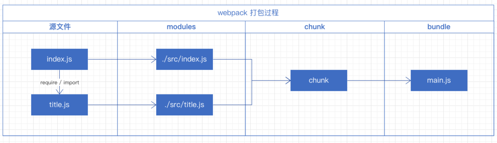
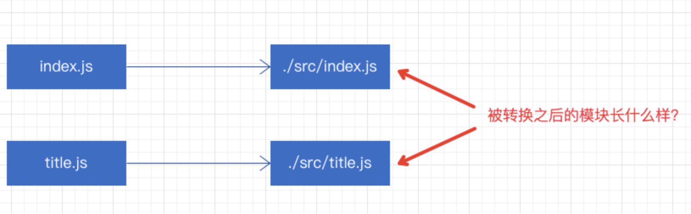
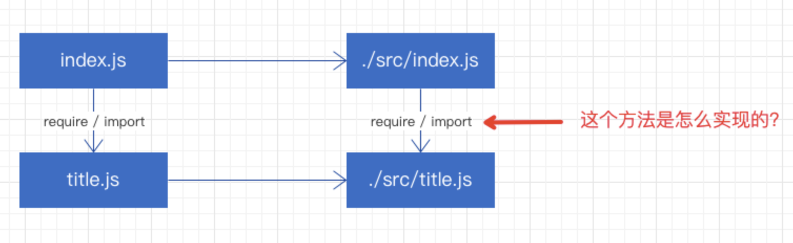
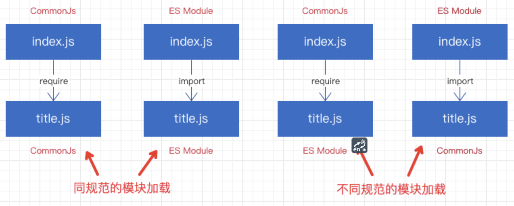

# Webpack 模块加载相关的打包产物分析
`此次分享基于 webpack 5.28.0 版本`

## 前言
- webpack 是我们日常的开发工作中经常接触的一款 **模块化打包工具** , 但是它是如何处理模块化的呢?
- 今天我们就从打包结果来看下 webpack 对模块化是如何处理的
- 在开始分享前, 我们先来大致介绍下 webpback 打包过程, 方便让大家知道我们在此次分享中重点关注的是哪方面的内容

  

- 通过这张简单的流程图我们可以看到 webpack 在打包过程中会涉及这么四个概念
  1. 源文件 就是我们书写的源代码
  2. modules 既模块, 由上图可知一个文件即是一个模块, 只不过最终的模块是经过 webpack 构建转义之后的, 与我们的源代码会有一些不同
  3. chunk 是代码块, webpack在构建 module 时, 会根据 module 的依赖关系, 收集所有的模块依赖, 最终形成 chunk, 我们可以把 chunk 视为一系列模块的集合
  4. bundle 最终的打包产物,  chunk 构建之后, 便会根据 chunk 生成与其对应的 bundle, 通常来讲 chunk 与 bundle 是一一对应的

## 问题
- 我们这次分享重点关注 源文件 -> moduels 这个过程
- 我们已经了解到 webpack 会把每个文件都当做一个模块处理, **这个模块可能是 CommonJs 模块或者 ES Module 模块, 那么webpack 是如何处理这个模块的**?
  
- **在一个模块内可以引入另一个模块, webpack 是如何实现模块的加载逻辑的?**
  
- **对于不同规范之间的模块引用, webpack 是如何兼容不同的模块化规范的?**
  

## 1. CommonJs - load - CommonJs
- 源文件
```js
// index.js
let title = require('./title.js'); // 采用 commonJs 导入 title.js 文件
console.log(title);

// title.js
module.exports = 'title'; // 采用 commonJs 导出 默认变量 'title'
```
- 打包后代码分析(非源码)
1. 代码主体
```js
(() => {
  // 模块对象 包含所有用到的模块
  var modules = {
    ...
  };
  // 模块缓存
  const cache = {};
  
  // 模块加载逻辑 核心方法
  function __webpack_require__(moduleId) {
    ...
  }
  
  // 入口
  (() => {
    // 1. 入口文件 对于 commonJs 规范的导入跟 index.js 保持一致
    // 2. webpack 会将 require 替换为自己实现 __webpack_require__ 方法
    let title = __webpack_require__('./src/title.js'); 
    console.log(title);
  })();
})();
```
2. modules 介绍
```js
var modules = {
  './src/title.js': (module, exports, require) => {
    module.exports = 'title'; 
  },
};
// webpack 运行时会根据模块间的依赖关系, 不断收集依赖, 直到所有依赖收集完毕构建出对应的代码快 chunk
// 这个 modules 对象便是根据 chunk 创建出来的, 它是由所有的模块构成的一个模块对象
// 它的 key 叫做模块ID, 是当前模块相对于 webpack 运行时的根目录的一个相对路径
// 它的 value 是一个函数, 接受 module exports require 三个参数
// 函数体内则是我们在 title 源文件中书写的源代码
```
3. webpack_require 实现模块加载的核心方法
```js
const cache = {}; // 模块缓存
function __webpack_require__(moduleId) {
  if (cache[moduleId]) return cache[moduleId].exports; // 命中缓存直接返回缓存内容
  const module = { exports: {} }; // 创建模块对象 module
  cache[moduleId] = module; // 缓存模块
  // 根据传入的 moduleId 在 modules 中找到对应的 模块函数执行
  // 通过 call 方法将模块函数执行时的 this 绑定为 module.exports 对象
  // 传入 module exports require
  modules[moduleId].call(module.exports, module, module.exports, __webpack_require__);
  // 返回 新建模块对象的 exports 属性值
  return module.exports;
}
```
4. 打包后代码的整体逻辑
```js
(() => {
  var modules = {
    // 4. 执行对应的模块代码
    './src/title.js': (module, exports, require) => {
      module.exports = 'title'; 
    },
  };
  const cache = {}; // 模块缓存
  // 3. webpack 自己实现的 __webpack_require__ 方法
  function __webpack_require__(moduleId) {
    if (cache[moduleId]) return cache[moduleId].exports;
    const module = { exports: {} };
    cache[moduleId] = module;
    modules[moduleId].call(module.exports, module, module.exports, __webpack_require__);
    return module.exports;
  }
  (() => {
    let title = __webpack_require__('./src/title.js'); 
    console.log(title);
  })();
})();
```

## 2. CommonJs - load - ES Module 
- 当我们使用 CommonJS 规范引入一个 ES Module 规范的模块时, webpack 会怎么做?
- 前置知识
  - [Symbol.toStringTag](https://developer.mozilla.org/zh-CN/docs/Web/JavaScript/Reference/Global_Objects/Symbol/toStringTag)
- 源文件
```js
// index.js
let title = require('./title');
console.log(title);
console.log(title.age);
// title.js
export default 'title_name';
export const age = 'title_age';
```
- 打包后代码分析
1. 代码主体
```js
(() => {
  var modules = {};
  
  const cache = {};
  
  function __webpack_require__(moduleId) {};
  
  __webpack_require__.tagExportsAsEsModule = (exports) => {};
  
  __webpack_require__.addAttributesToExports = (exports, definition) => {};
  
  (() => {
    // commonJs 规范的入口文件 打包后代码跟源代码 保持一致 
    let title = __webpack_require__('./src/title.js');
    console.log(title); // title 的值是什么?
    console.log(title.age);
  })();
})();
```
2. __webpack_require__.tagExportsAsEsModule 标记当前模块为 ES 模块
```js
  __webpack_require__.tagExportsAsEsModule = (exports) => {
    // 通过添加 __esModule 属性将其标记为 ES 模块
    Object.defineProperty(exports, '__esModule', { value: true });
    // 添加 Symbol.toStringTag 属性后,调用 toString() 方法时会返回 Symbol.toStringTag 的值   
    Object.defineProperty(exports, Symbol.toStringTag, { value: 'Module' });
  };
```
3. __webpack_require__.addAttributesToExports 为 exports 添加属性
```js
  __webpack_require__.addAttributesToExports = (exports, definition) => {
    for (const key in definition) {
      // 遍历 definition 对象
      // 将该对象的值 赋值到 exports 对象上
      Object.defineProperty(exports, key, {
        enumerable: true,
        get: definition[key],
      });
    }
  };
```
4. 对于 title 这个 ES Module 的模块 webpack 会怎么处理?
```js
  var modules = {
    './src/title.js': (module, exports, require) => {
      // 这里我们发现打包后的模块代码跟源代码不一致了 
      // 此时的 es 模块会被转换成 commonjs 模块来进行兼容处理
      require.tagExportsAsEsModule(exports); // 标记改模块为 ES 模块
      const DEFAULT_EXPORT = 'title_name';
      const age = 'title_age';
      require.addAttributesToExports(exports, {
        // export default 的默认导出值被赋值给了 exports 的 default 属性
        default: () => DEFAULT_EXPORT,
        // 其他属性正常赋值
        age: () => age,
      });
    },
  };
```
5. 整体逻辑
```js
(() => {
  var modules = {
    './src/title.js': (module, exports, require) => {
      require.tagExportsAsEsModule(exports);
      const DEFAULT_EXPORT = 'title_name';
      const age = 'title_age';
      require.addAttributesToExports(exports, {
        default: () => DEFAULT_EXPORT,
        age: () => age,
      });
    },
  };
  const cache = {};
  function __webpack_require__(moduleId) {
    if (cache[moduleId]) return cache[moduleId].exports;
    const module = { exports: {} };
    cache[moduleId] = module;
    modules[moduleId].call(module.exports, module, module.exports, __webpack_require__);
    return module.exports;
  }
  __webpack_require__.tagExportsAsEsModule = (exports) => {
    Object.defineProperty(exports, '__esModule', { value: true });
    Object.defineProperty(exports, Symbol.toStringTag, { value: 'Module' });
  };
  __webpack_require__.addAttributesToExports = (exports, definition) => {
    for (const key in definition) {
      Object.defineProperty(exports, key, {
        enumerable: true,
        get: definition[key],
      });
    }
  };
  (() => {
    let title = __webpack_require__('./src/title.js');
    console.log(title); // title 的值并不是 title_name 他的 default 属性值才是
    console.log(title.age);
  })();
})();
```
- webpack 对于 ES Module 的处理会对代码进行重构, 将 ES 模块转换成 CommonJS 模块
- 在 webpack 中 commonJs 加载 es 模块时 需要通过 default 属性才能取到 es 模块的默认导出

## 3. ES Module - load - ES Module
- 我们已经了解了 ES Module 模块作为被引入的模块时 webpack 是怎么处理的
- 我们再看下 ES Module 模块 作为入口模块时webpack 的处理方式
- 源代码
```js
// index.js
import title, { age } from './title';
console.log(title); // 默认导出
console.log(age);
// title.js
export default 'title_name';
export const age = 'title_age';
```
- 打包后代码分析
1. 代码主体
```js
(() => {
  var modules = {};
  const cache = {};
  function __webpack_require__(moduleId) {}
  __webpack_require__.tagExportsAsEsModule = (exports) => {};
  __webpack_require__.addAttributesToExports = (exports, definition) => {};
  
  const exports = {};
  (() => {
    // 这里发现入口模块的代码跟我们写的源代码不一样了
    // 此时 es 模块也会被转换成为 commonJs 模块
    __webpack_require__.tagExportsAsEsModule(exports); // 首先标记该模块是 es 模块
    let temp = __webpack_require__('./src/title.js');
    console.log(temp.default); // 将 es 模块的默认导出变量 更改为 default 属性输出
    console.log(temp.age); // 其余变量保持不变
  })();
})();
```
2. modules
```js
  var modules = {
    './src/title.js': (module, exports, require) => {
      require.tagExportsAsEsModule(exports);
      require.addAttributesToExports(exports, {
        default: () => DEFAULT_EXPORT,
        age: () => age,
      });
      const DEFAULT_EXPORT = 'title_name';
      const age = 'title_age';
    },
  };
```
3. 整体逻辑
```js
(() => {
  var modules = {
    './src/title.js': (module, exports, require) => {
      require.tagExportsAsEsModule(exports);
      require.addAttributesToExports(exports, {
        default: () => DEFAULT_EXPORT,
        age: () => age,
      });
      const DEFAULT_EXPORT = 'title_name';
      const age = 'title_age';
    },
  };
  const cache = {};
  function __webpack_require__(moduleId) {
    if (cache[moduleId]) return cache[moduleId].exports;
    const module = { exports: {} };
    cache[moduleId] = module;
    modules[moduleId].call(module.exports, module, module.exports, __webpack_require__);
    return module.exports;
  }
  __webpack_require__.tagExportsAsEsModule = (exports) => {
    Object.defineProperty(exports, '__esModule', { value: true });
    Object.defineProperty(exports, Symbol.toStringTag, { value: 'Module' });
  };
  __webpack_require__.addAttributesToExports = (exports, definition) => {
    for (const key in definition) {
      Object.defineProperty(exports, key, {
        enumerable: true,
        get: definition[key],
      });
    }
  };
  const exports = {};
  (() => {
    __webpack_require__.tagExportsAsEsModule(exports);
    let temp = __webpack_require__('./src/title.js');
    console.log(temp.default);
    console.log(temp.age);
  })();
})();
```

## 4. ES Module - load - CommonJs
- 我们再来分析最后一种 ES 作为入口模块, 加载 CommonJs 规范时, webpack 的处理方式
- 源代码
```js
// index.js
import title, { age } from './title';
console.log(title);
console.log(age);
// title.js
module.exports = {
  age: 18,
};
```
- 打包代码分析
1. 代码主体
```js
(() => {
  var modules = {};
  const cache = {};
  function __webpack_require__(moduleId) {}
  __webpack_require__.tagExportsAsEsModule = (exports) => {};
  __webpack_require__.addAttributesToExports = (exports, definition) => {};
  
  __webpack_require__.judgeModuleType = (exports) => {};
  
  const exports = {};
  (() => {
    // 此时 ES 模块代码会被转换 且不同于 es - load - es 时
    __webpack_require__.tagExportsAsEsModule(exports); // 标记该模块是 es 模块
    let temp = __webpack_require__('./src/title.js');
    // 调用 n 方法获取默认导出变量兼容，因为不知道导入的是 es 模块 还是 commonjs 模块
    const default_value = __webpack_require__.n(temp); 
    console.log(default_value());
    console.log(temp.age);
  })();
})();
```
2. __webpack_require__.judgeModuleType 识别模块类型 获取模块的默认导出变量
```js
  __webpack_require__.judgeModuleType = (exports) => {
    // 通过之前的标记属性 __esModule 判断导入模块类型
    // es 模块 则取其 default 属性 作为默认导出
    // commonJs 模块 取 exports 对象作为默认导出
    return exports.__esModule ? () => exports.default : () => exports;
  };
```
3. 整体逻辑
```js
(() => {
  var modules = {
    './src/title.js': (module, exports, require) => {
      module.exports = {
        age: 18,
      };
    },
  };
  const cache = {};
  function __webpack_require__(moduleId) {
    if (cache[moduleId]) return cache[moduleId].exports; 
    const module = { exports: {} };
    cache[moduleId] = module;
    modules[moduleId].call(module.exports, module, module.exports, __webpack_require__);
    return module.exports;
  }
  __webpack_require__.tagExportsAsEsModule = (exports) => {
    Object.defineProperty(exports, '__esModule', { value: true });
    Object.defineProperty(exports, Symbol.toStringTag, { value: 'Module' });
  };
  __webpack_require__.addAttributesToExports = (exports, definition) => {
    for (const key in definition) {
      Object.defineProperty(exports, key, {
        enumerable: true,
        get: definition[key],
      });
    }
  };
  __webpack_require__.judgeModuleType = (exports) => {
    return exports.__esModule ? () => exports.default : () => exports;
  };
  const exports = {};
  (() => {
    // 此时 ES 模块代码会被转换 且不同于 es - load - es 时
    __webpack_require__.tagExportsAsEsModule(exports); // 标记该模块是 es 模块
    let temp = __webpack_require__('./src/title.js');
    // 调用 n 方法获取默认导出变量兼容，因为不知道导入的是 es 模块 还是 commonjs 模块
    const default_value = __webpack_require__.n(temp); 
    console.log(default_value());
    console.log(temp.age);
  })();
})();
```
## 总结
### 1. 经过 webpack 转换后的模块长什么样? 
1. 打包后输出文件的 modulse 对象, 就是 webpack 打包后的模块集合, 这个对象里边包含了是用到的所有模块, 使用 moduleId 作为 key, 而 value 则是使用函数的方式将模块包裹, 以便可以随时调用模块

### 2. webpack 是如何实现模块的加载逻辑的?
1. webpack 自身实现 webpack_require 方法
2. 配合构建后的 modules 对象
3. 通过模块ID找到对应的模块函数执行
4. 执行时会执行我们书写的源代码 给模块的exports 对象赋值
5. 返回最终的模块的 exports 属性

### 3. webpack 是怎么处理 CommonJs 跟 ES Module 规范的模块的? 是如何兼容不同的模块化规范的?
1. 对于 CommonJs 模块, webpack 在实现时就是按照它来设计的, 对于 CommonJs 规范的模块, webpack 不需要做代码的转义工作, 直接将源代码包裹到函数中
2. 对于 ES Module 模块, 核心逻辑就是 ES 模块的代码重构, 将其转换成 CommonJs 模块来处理