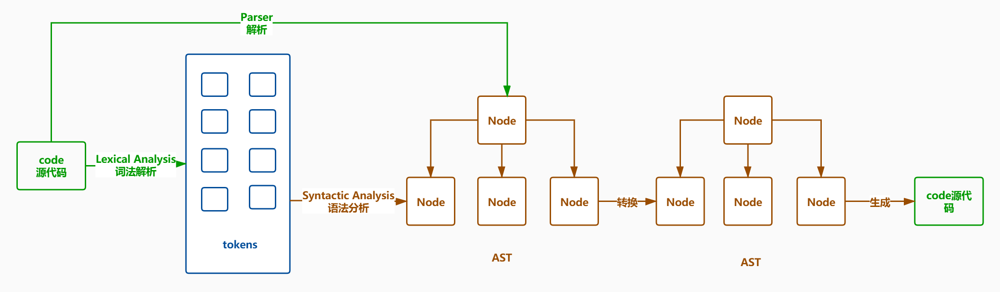

## AST 抽象语法树
- webpack 的核心就是通过抽象语法树来实现对代码的检查、分析等操作。

## 用途
- 代码语法的检查、代码风格的检查、代码的格式化、代码高亮、代码错误提示、代码自动补全等等。
  - 如 JSLint、JSHint 对代码错误或风格的检查，发现一些潜在的错误
  - IDE 的错误提示、格式化、高亮、自动补全等等
- 代码混淆压缩。
  - UglifyJS2 等
- 优化变更代码，改变代码结构达到想要的结构。
  - 代码打包工具 webpack、rollup 等等
  - TypeScript、JSX 等转化为原生 Javascript

## 定义
- 抽象语法树定义了代码的结构，通过这棵树可以精准的定位到声明语句、赋值语句、运算语句等等、实现对代码的分析、优化、变更等操作。

## 解析器 Javascript Parser
- 把JavaScript源码转化为抽象语法树的解析器。
- 浏览器会把JavaScript源码通过解析器转为抽象语法树,再进一步转化为字节码或直接生成机器码。
- 一般来说每个JavaScript引擎都会有自己的抽象语法树格式，Chrome 的 v8 引擎，firefox 的 SpiderMonkey 引擎等等，MDN 提供了详细SpiderMonkey AST format 的详细说明，算是业界的标准。
  
## 常用的 JavaScript Parser
  - esprima
  - traceur
  - acorn
  - shift
  
## 遍历语法树
```js
let esprima = require('esprima');//把JS源代码转成AST语法树
let estraverse = require('estraverse');///遍历语法树,修改树上的节点
let escodegen = require('escodegen');//把AST语法树重新转换成代码

let code = `function ast(){}`;
let ast = esprima.parse(code)
let indent = 0
const padding = ()=>' '.repeat(indent)
estraverse.traverse(ast,{
  enter(node){
    console.log(padding()+node.type+'进入');
      if(node.type === 'FunctionDeclaration'){
        node.id.name = 'newAst';
      }
    indent+=2;
  },
  leave(){
    indent-=2;
    console.log(padding()+node.type+'离开');
  }
})
/*
Program进入
  FunctionDeclaration进入
    Identifier进入
    Identifier离开
    BlockStatement进入
    BlockStatement离开
  FunctionDeclaration离开
Program离开
*/

console.log(escodegen.generate(ast))
/*
function newast(){}
*/
```

## Babel
- Babel 能够转译 ECMAScript 代码，使他能够在旧的浏览器环境中运行。
- 工作流程
  - Parse 解析，将源代码转换成抽象语法树，树上有很多节点
  - Transform 转换，将抽象语法树进行转换
  - Generate 代码生成，根据转换后的抽象语法树生成新的代码

- AST 遍历
  - 深度优先遍历
  - 访问者模式 Visitor
    - Visitor 定义了用于获取 AST 中具体节点的方法。
    - Visitor 上挂载了以节点 type 命名的方法，如果匹配上 type 就会执行对应方法。
- 插件
  - [可视化AST](https://astexplorer.net/)
  - [@babel/core](https://www.npmjs.com/package/@babel/core) Babel的编译器，包含了核心API，负责生成 AST 语法树，遍历 AST 语法树，根据语法树生成代码。
  - [babylon](http://www.zhufengpeixun.com/grow/html/103.4.webpack-ast.html) Babel 使用的解析器。
  - [babel-types](https://github.com/babel/babel/tree/master/packages/babel-types) 用于AST节点的工具库，包含了构造、验证、变化 AST 节点的方法，对于编写处理 AST 逻辑非常有用。
  - [@babel/template](https://babeljs.io/docs/en/babel-template) 把一个JS字符串转成AST语法树节点
  - [babel-traverse](https://www.npmjs.com/package/babel-traverse) 用于对AST进行遍历，维护整棵树的状态，并且负责替换，移除和添加节点。
  - [babel-types-api](https://babeljs.io/docs/en/next/babel-types.html)
  - [Babel 插件](https://github.com/brigand/babel-plugin-handbook/blob/master/translations/zh-Hans/README.md#asts)
  - [babel 可视化编译器](https://babeljs.io/en/repl.html)
- 手写插件
  - [转换箭头函数](../source/6.Babel/babel-plugin-transform-es2015-arrow-functions/demo.js)
  - [class转es5](../source/6.Babel/plugin-transform-classes/demo.js)