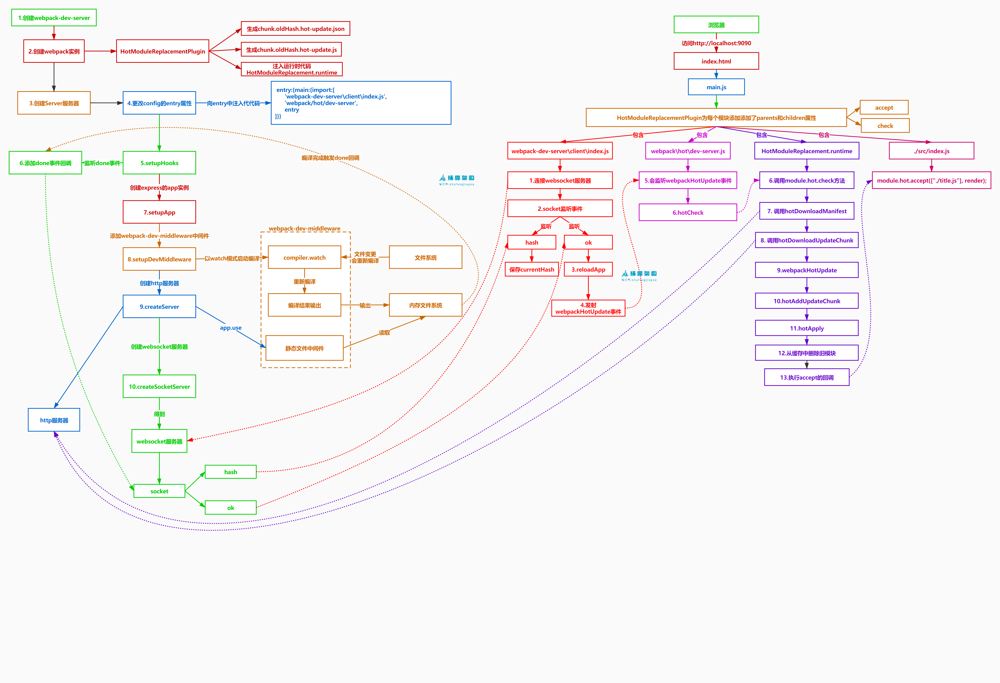

## HotModuleReplacementPlugin 
- 生成两个补丁文件
  - 上一次编译生成的hash.hot-update.json,用于说明从上次编译到现在哪些代码块发生成改变
  - chunk名字.上一次编译生成的hash.hot-update.js,存放着此代码块最新的模块定义,里面会调用webpackHotUpdate方法
- 向代码块中注入HMR runtime代码,热更新的主要逻辑,比如拉取代码、执行代码、执行accept回调都是它注入的到chunk中的
- hotCreateRequire 会帮我们给模块 module 的 parents、children 赋值

## webpack watch 监控模式
- 如果使用监控模式编译webpack的话,如果文件系统中有文件发生了改变,webpack会监听到并重新打包
- 每次编译会产生一个新的hash值

## 工作流程
1. 服务器部分
   - 启动webpack-dev-server服务器
     - 创建 webpack 实例
     - 创建 Server 服务器
       - 更新webpack实例的entry入口，此时会注入socket客户端代码，以及热更新的一些逻辑代码，比如代码的拉取，执行
       - 添加 webpack 的 done 事件回调，在每次编译完成时使用socket向浏览器发送消息
       - 创建express应用app
       - 添加express中间件 webpack-dev-middleware
         - 该中间件会使webpack以监听模式启动webapck的编译工作
         - 同时监听请求，提供打包后的文件的预览功能
       - 通过http.createServer(app) 创建 server
       - 通过socketIo 创建socket服务 建立与浏览器端的长连接
     - 调用server.listen启动服务
2. 客户端部分
   - 注入的 socket 客户端
     - 连接 webaocket 服务器
     - 监听 hash 事件 保存 hash 值
     - 监听 ok 事件执行 reloadApp 进行更新
     - 在 reloadApp 方法中会进行判断，是否支持热更新，支持就发射 webpackHotUpdate 事件，不支持直接刷新浏览器
   - webpack/hot/dev-server.js 会监听 webpackHotUpdate 事件
   - 在 check 方法中调用 module.hot.check 方法
   - 调用 hotDownloadManifest 向 Server 发送请求，服务端返回Manifest文件（lastHash.hot-update.json） ，该文件包含了本次编译hash值跟更新模块的名字
   - 调用 JsonpMainTemplate.runtime 的 hotDownloadUpdateChunk 方法通过JSONP请求获取到最新的模块代码
   - 补丁JS取回来后会调用 JsonpMainTemplate.runtime.js 的 webpackHotUpdate 方法
   - 然后会调用 HotModuleReplacement.runtime.js 的 hotAddUpdateChunk 方法动态更新模块代码
   - 然后调用 hotApply 方法进行热更新

## 流程图
